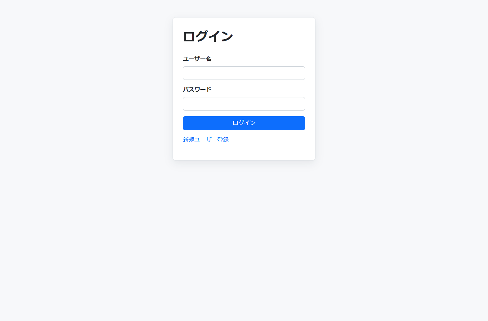
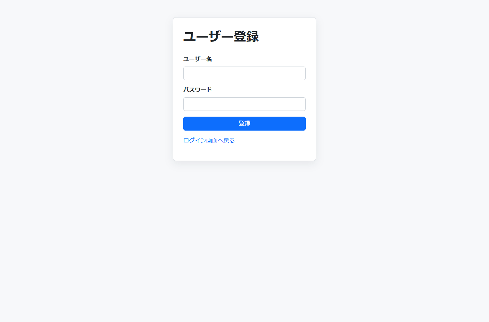
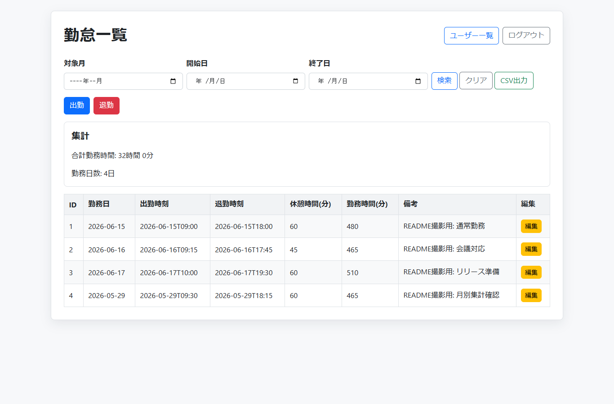
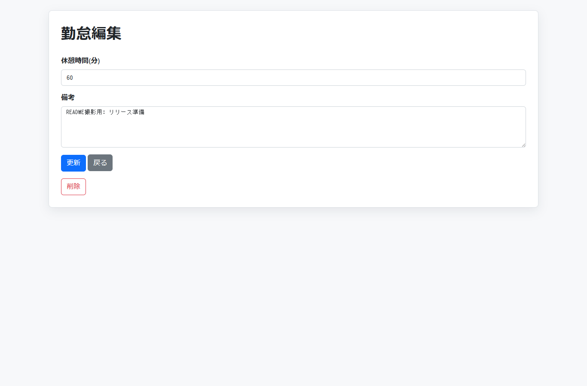
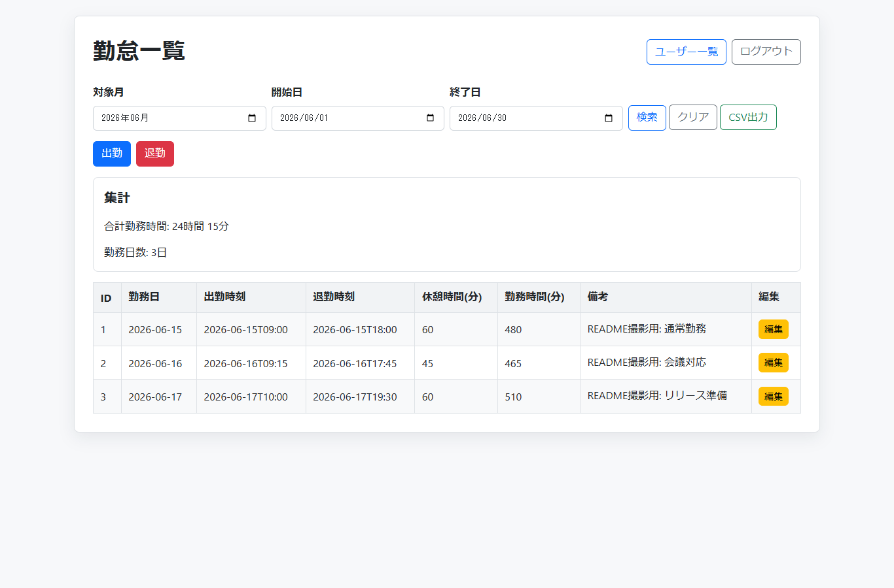
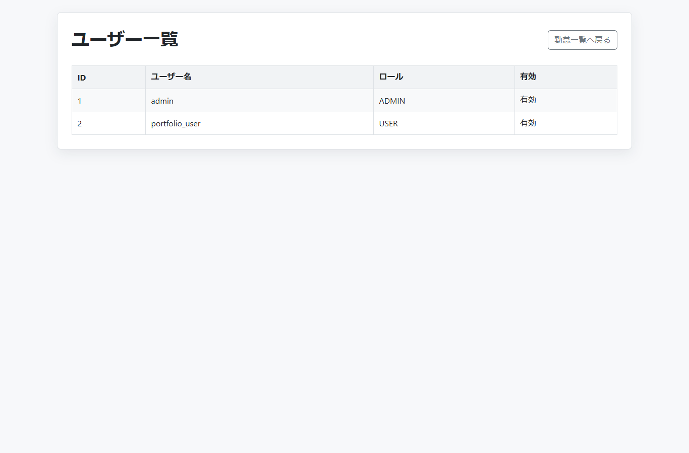
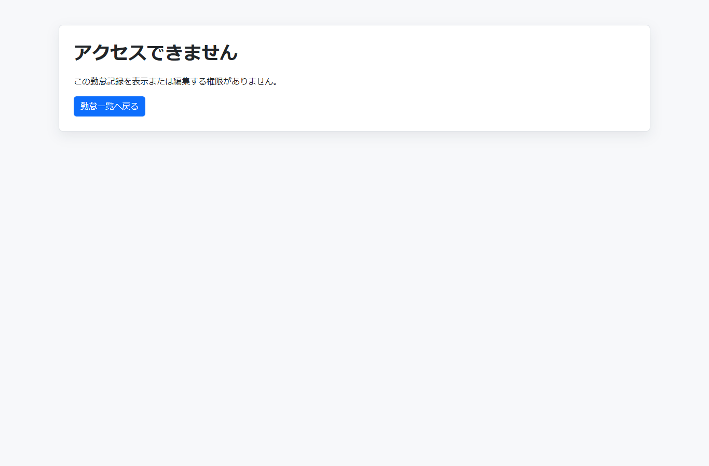
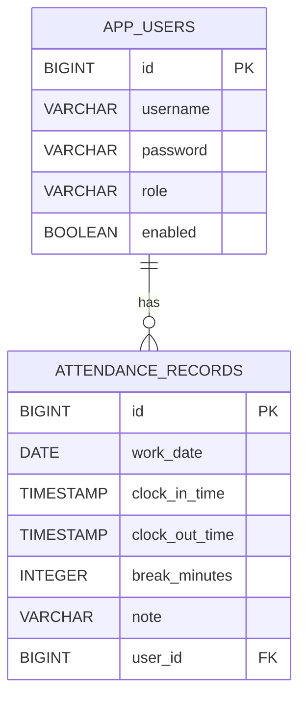

# AttendanceManager

Spring Boot と PostgreSQL で作成した勤怠管理アプリケーションです。

ログインしたユーザーごとに、出勤・退勤時刻、休憩時間、勤務時間を管理できます。
求職管理アプリ `jobmanager` の構成をもとに、勤怠管理向けに機能を置き換えています。

## 概要

AttendanceManager は、ユーザーごとの勤怠記録を管理するWebアプリケーションです。

主な目的は、Spring Boot の基本的なMVC構成、Spring Securityによるログイン機能、Spring Data JPAによるDB操作を学習しながら、ポートフォリオとして説明できるアプリを作ることです。

## 主な機能

- ユーザー登録
- ユーザー登録時の入力チェック
- ログイン / ログアウト
- 出勤打刻
- 退勤打刻
- 勤怠一覧表示
- 日付範囲による勤怠検索
- 休憩時間の編集
- 備考欄の編集
- 勤怠記録の削除
- 合計勤務時間の表示
- 月別集計
- CSV出力
- 管理者向けユーザー一覧
- ログイン中ユーザーごとの勤怠データ管理
- 他ユーザーの勤怠記録へのアクセス制限
- 打刻済みの日に重複して出勤できない制御

## 使用技術

- Java 21
- Spring Boot 3.5.15
- Spring Web
- Spring Security
- Spring Data JPA
- Thymeleaf
- PostgreSQL
- Maven
- Bootstrap 5
- ローカルCSS配信
- Docker Compose

## ディレクトリ構成

```text
src/main/java/com/example/attendancemanager
├── config
│   ├── DataInitializer.java
│   └── SecurityConfig.java
├── controller
│   ├── AdminController.java
│   ├── AttendanceController.java
│   ├── LoginController.java
│   └── RegisterController.java
├── entity
│   ├── AppUser.java
│   └── AttendanceRecord.java
├── repository
│   ├── AppUserRepository.java
│   └── AttendanceRepository.java
└── service
    ├── AttendanceService.java
    └── CustomUserDetailsService.java
```

## DB設定

`src/main/resources/application.properties` で PostgreSQL に接続します。

```properties
spring.datasource.url=jdbc:postgresql://localhost:5432/attendancemanager
spring.datasource.username=postgres
spring.datasource.password=${DB_PASSWORD}
```

DBパスワードは環境変数 `DB_PASSWORD` に設定します。

PowerShell の例:

```powershell
$env:DB_PASSWORD="your_postgres_password"
```

## 起動方法

PostgreSQL に `attendancemanager` データベースを作成します。

```sql
CREATE DATABASE attendancemanager;
```

その後、プロジェクト直下で起動します。

```powershell
.\mvnw.cmd spring-boot:run
```

ブラウザで以下にアクセスします。

```text
http://localhost:8080/login
```

## Docker Composeでの起動

Docker Desktop が起動している状態で、以下を実行します。

```powershell
docker compose up --build
```

アプリケーションとPostgreSQLがまとめて起動します。

```text
http://localhost:8080/login
```

停止する場合:

```powershell
docker compose down
```

## テスト実行

Pleiades同梱のJava 21を使ってテストを実行するスクリプトを用意しています。

```powershell
.\scripts\test.ps1
```

このスクリプトは `JAVA_HOME` を `C:\pleiades\2025-09_Java\java\21` に設定してから、Maven Wrapperでテストを実行します。

## 初期ユーザー

アプリ起動時に、以下の初期ユーザーを自動作成します。

```text
ユーザー名: admin
パスワード: password
```

パスワードは BCrypt でハッシュ化して保存されます。

## 画面

- `/login` ログイン画面
- `/register` ユーザー登録画面
- `/attendance` 勤怠一覧画面
- `/attendance/{id}/edit` 休憩時間編集画面
- `/admin/users` 管理者向けユーザー一覧画面

## README用スクリーンショット

スクリーンショットは `docs/screenshots/` に格納します。

- `login.png` ログイン画面
- `register.png` ユーザー登録画面
- `attendance-list.png` 勤怠一覧画面
- `attendance-search.png` 日付範囲で検索した勤怠一覧画面
- `attendance-edit.png` 休憩時間・備考の編集画面
- `monthly-summary.png` 月別集計画面
- `csv-export.png` CSV出力ボタンまたは出力結果が分かる画面
- `admin-users.png` 管理者向けユーザー一覧画面
- `access-denied.png` 権限がない場合の403画面

### 画面サンプル

#### ログイン画面



#### ユーザー登録画面



#### 勤怠一覧画面



#### 日付範囲検索


#### 勤怠編集画面



#### 月別集計



#### CSV出力


#### 管理者向けユーザー一覧



#### アクセス制限



## ER図



## 今後追加したい機能

- READMEへのスクリーンショット掲載

## 学習ポイント

- Controller / Service / Repository のレイヤー分割
- Spring Security によるDB認証
- BCrypt によるパスワードハッシュ化
- JPAリポジトリによる検索処理
- ログインユーザーごとのデータ分離
- Thymeleaf による画面表示
